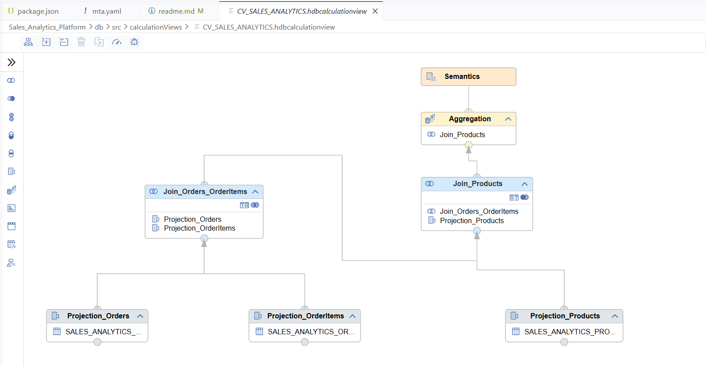
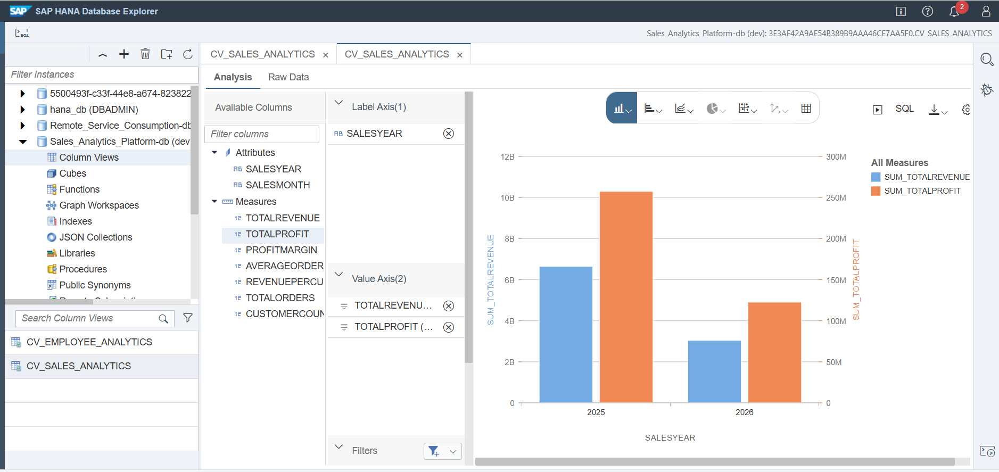
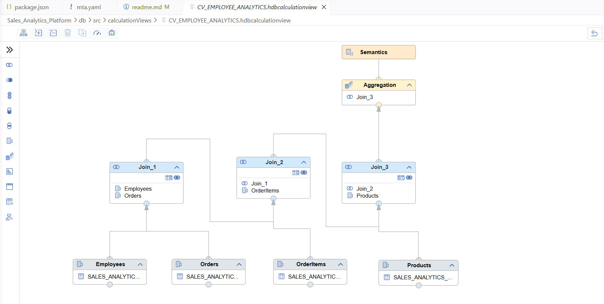
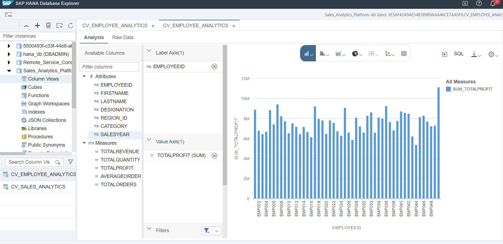

# Sales Analytics Platform

An SAP CAP and SAP HANA Cloud application for sales reporting and customer-tier maintenance. It combines the CAP transactional data model with native HANA calculation views and a SQLScript procedure.

## Highlights

- **Sales analytics** by year and month, including revenue, profit, order volume, customer count, and derived KPIs.
- **Employee analytics** by employee, region, product category, and sales year.
- **Customer tier refresh** based on each customer's lifetime revenue and order history.
- **OData services** that expose the analytics views as read-only entities and the tier refresh as an action.

## Architecture

```text
CAP domain model + CSV seed data
            |
            v
SAP HANA Cloud / HDI container
  - CV_SALES_ANALYTICS
  - CV_EMPLOYEE_ANALYTICS
  - updateCustomerTier procedure
            |
            v
CAP OData services
```

## Calculation views

Native calculation views are stored in [`db/src/calculationViews`](db/src/calculationViews). Both are HANA **CUBE** calculation views, designed to aggregate sales data at the requested reporting grain.

### Sales analytics - `CV_SALES_ANALYTICS`

This view joins **Orders** to **Order Items**, then left-joins **Products**. It gives a time-oriented view of overall sales performance.

```text
Orders -- inner join -- Order Items -- left join -- Products
   ID = ORDER_ID                     PRODUCT_ID = ID
```

Dimensions:

- `SALESYEAR` - year extracted from `ORDERDATE`
- `SALESMONTH` - month name extracted from `ORDERDATE`

| Measure | Definition |
| --- | --- |
| `TOTALREVENUE` | Sum of order `NETAMOUNT` |
| `TOTALPROFIT` | `LINEAMOUNT - (QUANTITY x COSTPRICE)` |
| `TOTALORDERS` | Distinct order count, using `ORDER_ID` exception aggregation |
| `CUSTOMERCOUNT` | Customer count based on `CUSTOMER_ID` |
| `PROFITMARGIN` | `(TOTALPROFIT / TOTALREVENUE) x 100` |
| `AVERAGEORDERVALUE` | `TOTALREVENUE / TOTALORDERS` |
| `REVENUEPERCUSTOMER` | `TOTALREVENUE / CUSTOMERCOUNT` |

<!-- Screenshot placeholder: add sales calculation-view dataflow at docs/images/sales-calculation-view.png -->


<!-- Screenshot placeholder: add sales analytics results at docs/images/sales-analytics-results.png -->


### Employee analytics - `CV_EMPLOYEE_ANALYTICS`

This view attributes sales activity to employees and enriches it with product information. It is intended for sales-force performance analysis across roles, regions, categories, and years.

```text
Employees -- inner join -- Orders -- inner join -- Order Items -- inner join -- Products
    ID = SALESEMPLOYEE_ID       ID = ORDER_ID                 PRODUCT_ID = ID
```

Dimensions:

- `EMPLOYEEID`, `FIRSTNAME`, `LASTNAME`, `DESIGNATION`
- `REGION_ID`, `CATEGORY`, `SALESYEAR`

| Measure | Definition |
| --- | --- |
| `TOTALREVENUE` | Sum of `NETAMOUNT` |
| `TOTALQUANTITY` | Sum of item `QUANTITY` |
| `TOTALPROFIT` | `LINEAMOUNT - (QUANTITY x COSTPRICE)` |
| `TOTALORDERS` | Distinct order count, using `ORDERID` exception aggregation |
| `AVERAGEORDERVALUE` | `TOTALREVENUE / TOTALORDERS` |

<!-- Screenshot placeholder: add employee calculation-view dataflow at docs/images/employee-calculation-view.png -->


<!-- Screenshot placeholder: add employee analytics results at docs/images/employee-analytics-results.png -->


## Customer-tier procedure

[`updateCustomerTier.hdbprocedure`](db/src/procedures/updateCustomerTier.hdbprocedure) is a native HANA SQLScript procedure that recalculates customer metrics from the `SALES_ANALYTICS_ORDERS` table and updates eligible customer records in one database operation.

### Processing flow

1. Aggregate each customer's order revenue and order count.
2. Update `LIFETIMEREVENUE`, `TOTALORDERS`, and `LASTTIERUPDATE` in `SALES_ANALYTICS_CUSTOMERS`.
3. Assign the tier from lifetime revenue:

| Lifetime revenue | Tier |
| ---: | --- |
| `>= 5,000,000` | Platinum |
| `>= 2,000,000` | Gold |
| `>= 500,000` | Silver |
| Below `500,000` | Bronze |

4. Return the number of updated customer records through the `updatedCount` output parameter.

The CAP action `CatalogService.updateCustomerTier()` executes the procedure and returns a status message with the update count.

<!-- Screenshot placeholder: add SQLScript procedure at docs/images/customer-tier-procedure.png -->


<!-- Screenshot placeholder: add customer-tier result at docs/images/customer-tier-results.png -->


## Services

| Service | Endpoint / capability |
| --- | --- |
| `AnalyticsService` | Read-only projections: `SalesAnalytics` and `EmployeeAnalytics` |
| `CatalogService` | Core sales entities plus `updateCustomerTier()` |

With the application running locally, OData V4 endpoints are available under:

```text
/odata/v4/analytics/
/odata/v4/catalog/
```

## Project structure

```text
app/                         SAP Fiori application content
db/schema.cds                CAP domain model and calculation-view declarations
db/data/                     CSV seed data
db/src/calculationViews/     Native HANA calculation views
db/src/procedures/           Native HANA SQLScript procedures
srv/                         CAP OData service definitions and handlers
scripts/                     Sample-data generation utilities
```

## Run locally

### Prerequisites

- Node.js LTS and npm
- SAP CAP tooling (`@sap/cds-dk` is included as a development dependency)

### Start the service

```bash
npm install
npx cds watch
```

For local development, the project is configured to use SQLite. The native HANA calculation views and SQLScript procedure are deployed when targeting SAP HANA Cloud through the HDI container.

## Build and deploy

```bash
npm run build
npm run deploy
```

Deployment configuration - including the HDI container, XSUAA, destination service, and HTML5 application repository - is defined in [`mta.yaml`](mta.yaml).

## Add screenshots

Create a `docs/images/` directory and add the six image files referenced above. The placeholders will render automatically once the screenshots are present.
